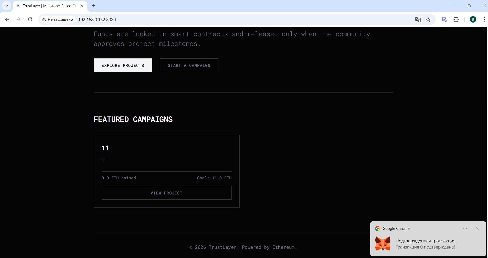
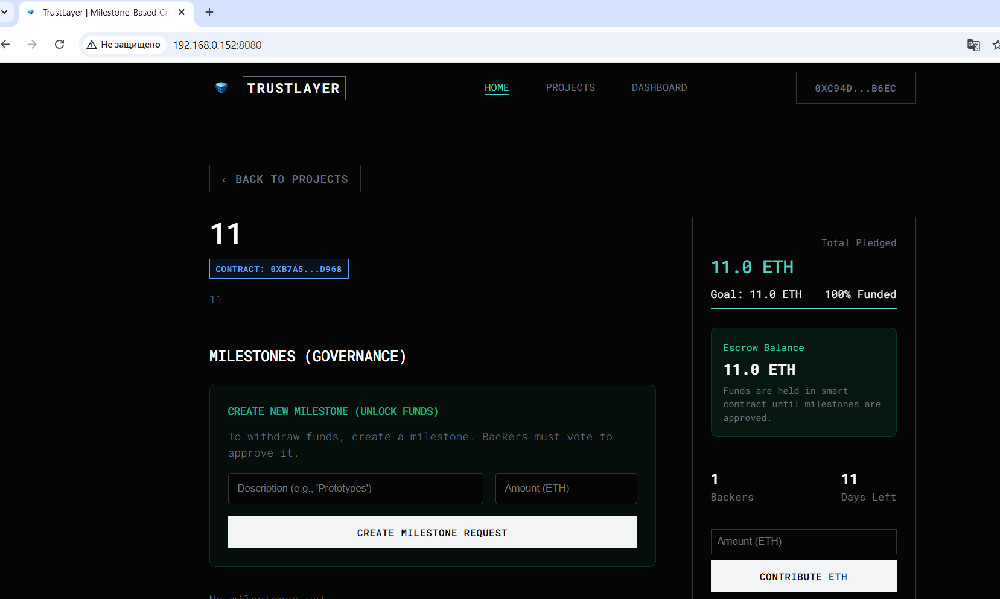
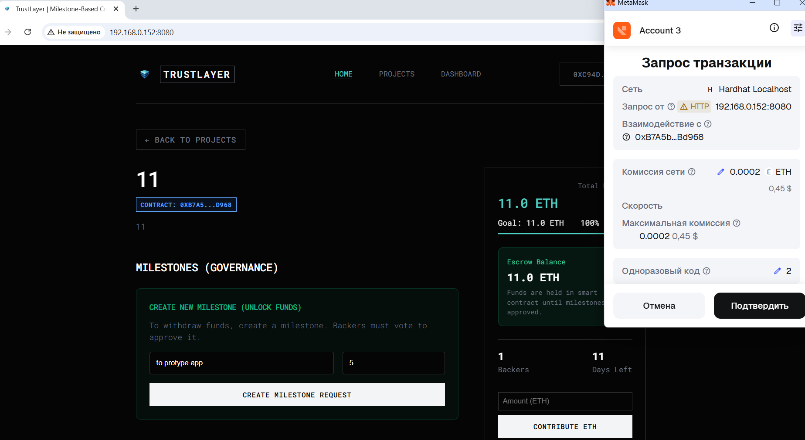
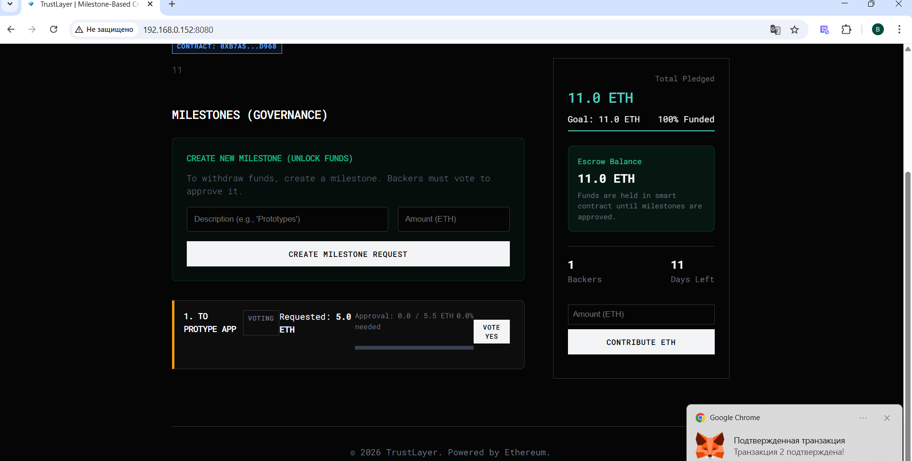
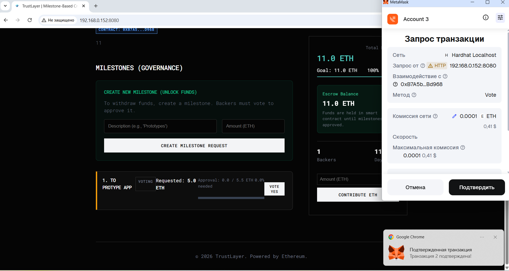
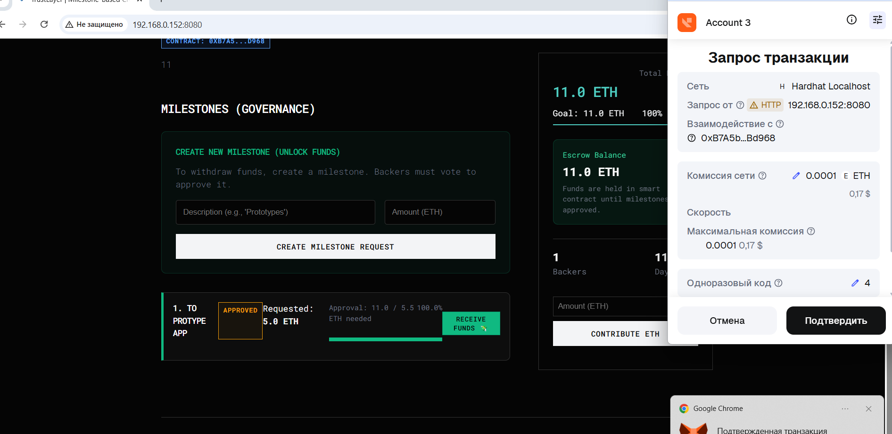
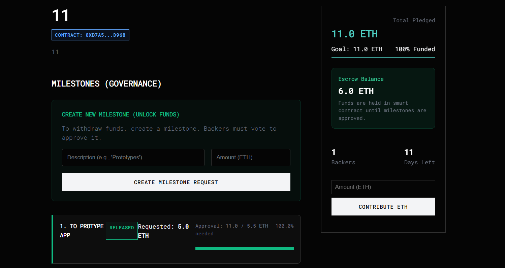

# TrustLayer: Trustless Milestone-Based Crowdfunding

**A decentralized platform where funds are released only when creators meet their milestones.**

---

## 👥 Authors / Team
- **Duisenbek Bekzat**
- **Nur-Adilet Mustafa**
- **Aknur Ondasyn**

---

## 📖 Project Overview

**TrustLayer** solves the biggest problem in crowdfunding: **Trust**. Instead of giving all money to the creator at once, backers' funds are locked in a smart contract. The creator must submit **Milestone Requests** (e.g., "Build Prototype", "Marketing Phase"), and backers **Vote** (proportional to their contribution) to approve the release of funds.

This ensures:
1.  **Accountability:** Creators must deliver results to get paid.
2.  **Safety:** Backers control the flow of funds.
3.  **Transparency:** All transactions and votes are on-chain.

---

## 🚀 Key Features

*   **Milestone-Based Funding:** Money is released in stages, not lumpsum.
*   **Decentralized Governance:** Contributors vote "Yes" to approve fund release.
*   **Trustless Escrow:** Smart contracts hold the ETH, not a middleman.
*   **Reward Tokens (TSL):** Backers receive TSL tokens as a proof of contribution (1 ETH = 1000 TSL).
*   **Transparent Dashboard:** Real-time tracking of goals, funds raised, and voting status.

---

## 🖼️ Gallery (Step-by-Step Walkthrough)

> Below is the complete user journey demonstrating how a campaign is created, funded, and how milestones are approved by the community.

### 1. Campaign Created
> First, the creator starts a new campaign. The contract is deployed to the blockchain.


### 2. Goal Reached (Funding)
> Backers contribute ETH. Once the goal is reached, the campaign is fully funded, and funds are locked in escrow.


### 3. Creating a Milestone Request
> To withdraw funds, the creator must submit a specific milestone proposal explaining what the funds are for (e.g., "Building Prototype").


### 4. Voting Stage
> Contributors review the milestone. Voting is open to all backers.


### 5. Casting a Vote
> Backers vote "Yes" to approve the milestone. Their voting power is proportional to their contribution amount.


### 6. Milestone Approved
> Once enough votes are gathered (>50%), the milestone status changes to **Approved**.


### 7. Ready to Receive Funds
> The creator can now see that the funds are unlocked and ready for withdrawal.


### 8. Funds Released
> The milestone is marked as **Released**, and the specific amount of ETH is transferred to the creator's wallet.


### 9. Transaction Complete
> The creator successfully receives the funds in their wallet.


---

## 🛠️ Technology Stack

*   **Frontend:** HTML5, CSS3 (Custom Design System), Vanilla JavaScript
*   **Blockchain:** Ethereum (Hardhat Localhost)
*   **Smart Contracts:** Solidity (v0.8.20)
*   **Library:** Ethers.js (v6)

---

## 💻 How to Run Locally

1.  **Clone the Repository**
    ```bash
    git clone https://github.com/duesenbek/trustlayer.git
    cd trustlayer/trustlayer
    ```

2.  **Install Dependencies**
    ```bash
    npm install
    ```

3.  **Start Local Blockchain**
    ```bash
    npx hardhat node
    ```

4.  **Deploy Contracts** (In a new terminal)
    ```bash
    npx hardhat run scripts/deploy.js --network localhost
    ```
    *(Copy the Factory address)*

5.  **Start Frontend**
    ```bash
    npm run dev
    ```
    *Open http://localhost:8080*

6.  **Setup MetaMask**
    - Network: `Localhost 8545` (Chain ID: `31337`)
    - Import Account: Use one of the private keys from Hardhat output.

---

## 📝 License
This project is for educational purposes as part of the Blockchain Course (Trim 2).
